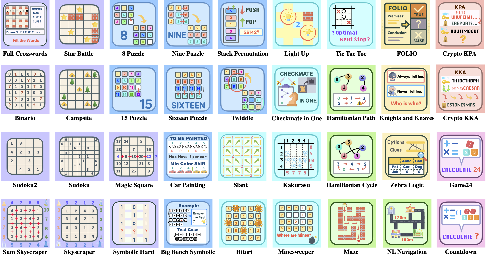
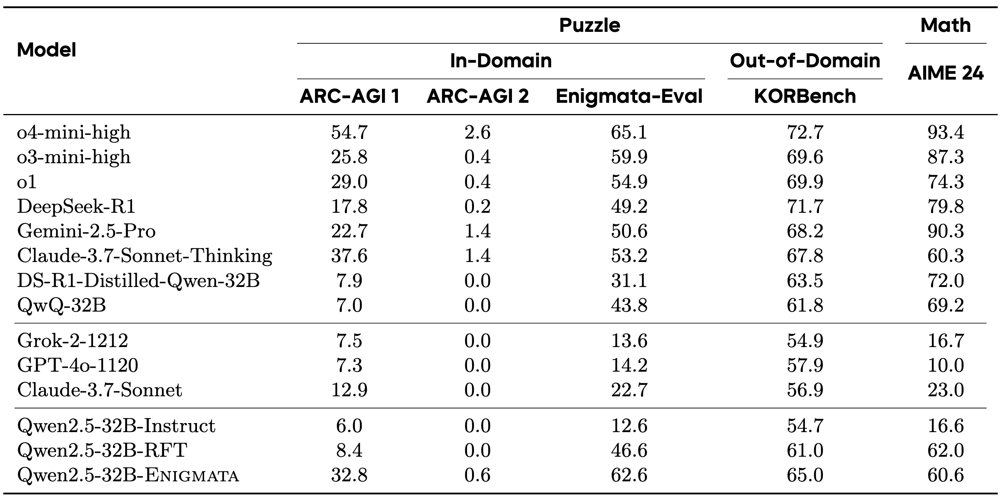
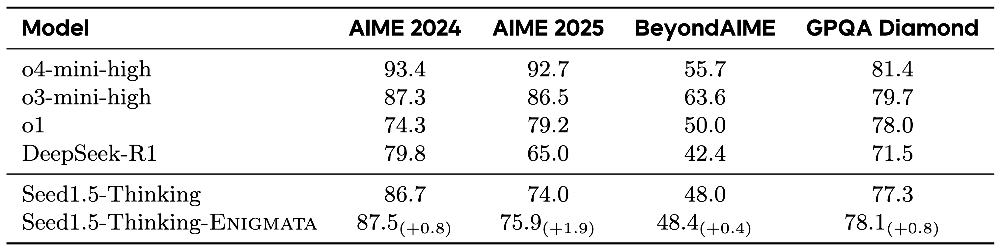

# Enigmata: Scaling Logical Reasoning in Large Language Models with Synthetic Verifiable Puzzles

<p align="center">
  <a href="http://arxiv.org/abs/2505.19914">📄 Paper</a> •
  <a href="https://seed-enigmata.github.io">🏠 HomePage</a> •
  <a href="https://huggingface.co/datasets/BytedTsinghua-SIA/Enigmata-Data">🤗 HF Dataset</a> • 
  <a href="https://huggingface.co/datasets/BytedTsinghua-SIA/Enigmata-Eval">🤗 Eval</a> • 
  <a href="https://huggingface.co/BytedTsinghua-SIA/Enigmata-Qwen2.5-32B">🤖 Model</a>
</p>


We introduce **Enigmata**, the *first* comprehensive suite tailored for improving LLMs with puzzle reasoning skills, which integrates seamlessly with reinforcement learning using verifiable rule-based rewards. 

**Enigmata-Data** includes *36 tasks across 7 categories*, each with: 1) a *generator* that produces unlimited examples with controllable difficulty, and 2) a rule-based *verifier* for automatic evaluation. This generator-verifier design supports scalable, multi-task RL training, fine-grained analysis, and seamless RLVR integration.
We further propose **Enigmata-Eval**, a rigorous benchmark for assessing puzzle reasoning abilities and guiding research on generalizable reasoning models. 

**Qwen2.5-32B-Enigmata**, trained with RLVR, consistently surpasses o3-mini-high and o1 on the puzzle reasoning benchmarks like Enigmata-Eval, ARC-AGI, and ARC-AGI 2. It also generalizes well to out-of-domain puzzle benchmarks and mathematical reasoning, with little multitasking trade-off.

When trained on **larger models like [Seed1.5-Thinking](https://arxiv.org/abs/2504.13914)** (20B activated parameters and 200B total parameters), **puzzle data from Enigmata further boosts SoTA performance on advanced math and STEM reasoning tasks** such as AIME (2024-2025), BeyondAIME and GPQA (Diamond), showing nice generalization benefits of Enigmata.

***We hope Enigmata serves as a solid foundation for the community to push forth the research on reasoning models!***

<center>
  
</center>

<div style="margin-top: 30px;"></div>


## 🧩 Enigmata-Data: Synthetic Verifiable Puzzle Generation

**📥 Download Enigmata-Data**: [HuggingFace Dataset](https://huggingface.co/datasets/BytedTsinghua-SIA/Enigmata-Data)


### 🔍 Dataset Overview
Enigmata-Data comprises *36 distinct task* types spanning *7 categories* of logical reasoning puzzles. Each task is built with two core components:

- **Generator**: Produces *unlimited* puzzle instances with precisely controllable difficulty parameters
- **Verifier**: Provides *automatic*, *rule-based* solution validation for reliable evaluation

For comprehensive details on each task, please refer to our [task documentation](verifiable_tasks/README.md).

The generator-verifier design yields three key benefits:

- **Unlimited Self-Verifying Data**: It can generate an unlimited supply of self-verifying puzzle prompts, which plug seamlessly into the RLVR framework and support long chain-of-thought training.  

- **Controlled Difficulty**: Programmatic difficulty control allows researchers to mix puzzles in desired difficulty ratios and to conduct fine-grained experiments on how curriculum design influences reinforcement learning.  

- **Flexible Task Sampling**: Generators can emit arbitrary sample counts per task, enabling studies of task balancing and cross-task generalization.

### 🏃 Quick Start: Generating Puzzle Data

Use our streamlined generation pipeline to create custom puzzle datasets:

```bash
# Generate training data for specific tasks
python3 generate_all_tasks.py \
    --count 2000 \
    --split train \
    --output /your/training/data/path \
    --tasks maze

# Generate evaluation data
python3 generate_all_tasks.py \
    --count 1000 \
    --split test \
    --output /your/evaluation/data/path \
    --tasks maze

# Ensure data integrity with leakage detection
python check_data_leakage.py \
    --eval-root /your/evaluation/data/path \
    --train-root /your/training/data/path \
    --output-root /your/clean/evaluation/path \
    --report /your/reports/data_leakage_report.csv
```

**Pro Tip**: Omit `--tasks` parameter to generate data for all 36 available tasks simultaneously.

## ⚖️ Enigmata-Eval: Evaluating Logical Reasoning Capabilities

### 📊 Benchmark Overview

Enigmata-Eval is a comprehensive benchmark containing 4,758 puzzle instances across Easy, Medium, and Hard difficulty levels. Each task provides 50 instances per difficulty level where possible, with strict train-eval separation to prevent data leakage.

**📥 Download Enigmata-Eval**: [HuggingFace Dataset](https://huggingface.co/datasets/BytedTsinghua-SIA/Enigmata-Eval)

### 🧐 Quick Evaluation

Place your model's predictions of the tasks in the `output` column of `result.parquet` correspondingly, then evaluate model solutions across all tasks with:

```bash
# Run comprehensive evaluation
python test_eval.py --input result.parquet

```

The evaluation uses task-specific verifiers for automated solution validation.


## 🤖 Enigmata-Model: The Training Recipe

Developing advanced logical reasoning in language models requires a carefully structured training approach. We develop **Qwen2.5-32B-Enigmata** through a two-stage training process that systematically builds logical reasoning capabilities while maintaining generalization across domains: 
- **Stage 1: Rejection Fine-tuning (RFT)** to establish foundational reasoning patterns
- **Stage 2: Multi-task RL with Verifiable Rewards** to develop general reasoning skills that transfer across diverse problem domains

### 👀 Performance Results


Our trained model **Qwen2.5-32B-Enigmata** demonstrates superior performance across puzzle reasoning benchmarks and maintains strong mathematical reasoning capabilities.


<center>
  
</center>


On Enigmata-Eval, our Qwen2.5-32B-Enigmata model excels in *Crypto*, *Arithmetic*, and *Logic* tasks, indicating strong rule-based reasoning. It also performs competitively in search tasks, though spatial and sequential categories remain challenging.

<center>
  
</center>

### 🌟 Generalization with Scaling: Free Lunch from Enigmata

Incorporating the **Enigmata-Data** synthetic puzzle dataset into large-scale model training, e.g., [Seed1.5-Thinking](https://arxiv.org/abs/2504.13914) (20B/200B), surprisingly improving performance on challenging benchmarks like AIME and GPQA Diamond. This demonstrates a **generalization benefit** for advanced reasoning models.

<center>
  
</center>

## 📝 Citation

If you find this work helpful, please cite our paper:
```bibtex
@article{chen2025enigmata,
  title={Enigmata: Scaling Logical Reasoning in Large Language Models with Synthetic Verifiable Puzzles},
  author={Chen, Jiangjie and He, Qianyu and Yuan, Siyu and Chen, Aili and Cai, Zhicheng and Dai, Weinan and Yu, Hongli and Yu, Qiying and Li, Xuefeng and Chen, Jiaze and others},
  journal={arXiv preprint arXiv:2505.19914},
  year={2025}
}
```
